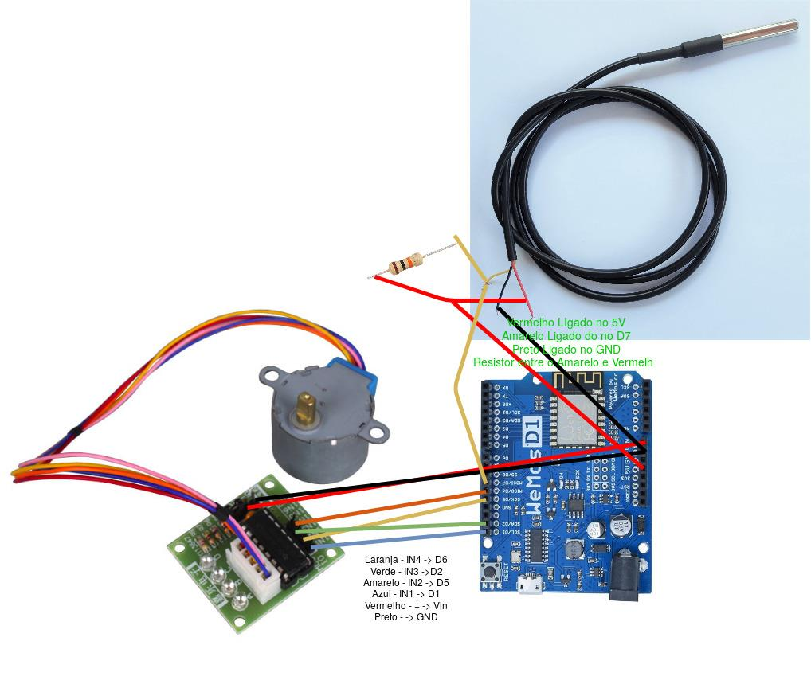
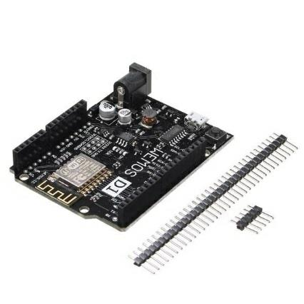
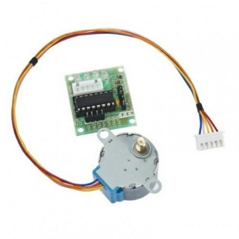
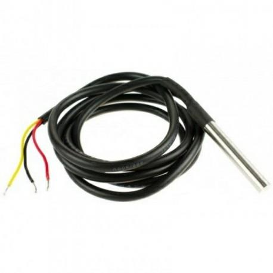
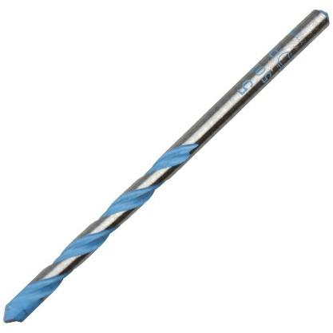
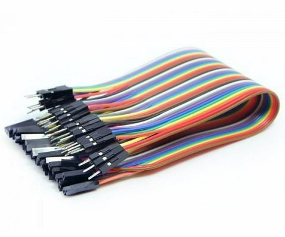

# Descriçao do Hardware

Os componentes serão utilizados em sincronia para que o protótipo seja capaz de alimentar peixes e medir a temperatura da água via aplicativo MQTT Dash.

## Diagrama elétrico

## Componentes:
* Placa WeMos D1 R2 Wifi ESP8266

Funciona como cérebro do sistema, responsável por sincronizar os demais componentes.

* Motor de Passo + Drive ULN2003

Responsável por movimentar o componente que será utilizado para empurrar o alimento para o aquário.

* Sensor de temperatura a prova de água DS18B20 - 1m

Responsável por entrar em contato com a água e através de sua ponta metálica obter a temperatura e disponibilizá-la na aplicação.

* Broca de 5MM

Acoplada ao motor de passo será responsável por empurrar a comida para o aquário.

* Fios/Jumpers

Responsáveis pela conexão entre os componentes.

* Pote plástico

Utilizado para sustentar os componentes do dispositivo.

